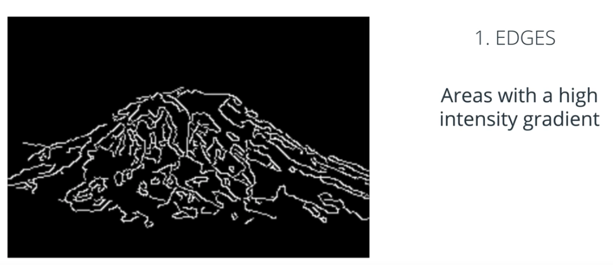
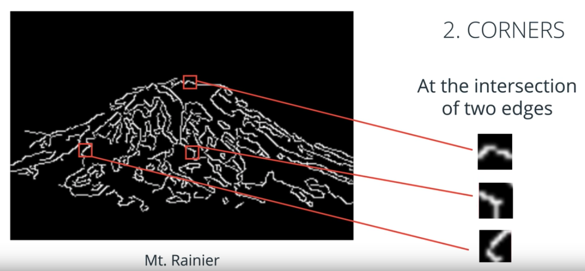
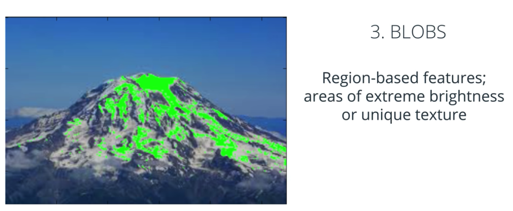
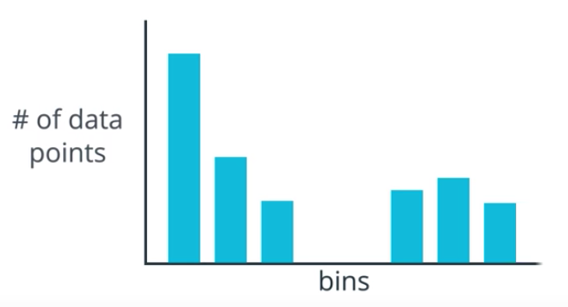
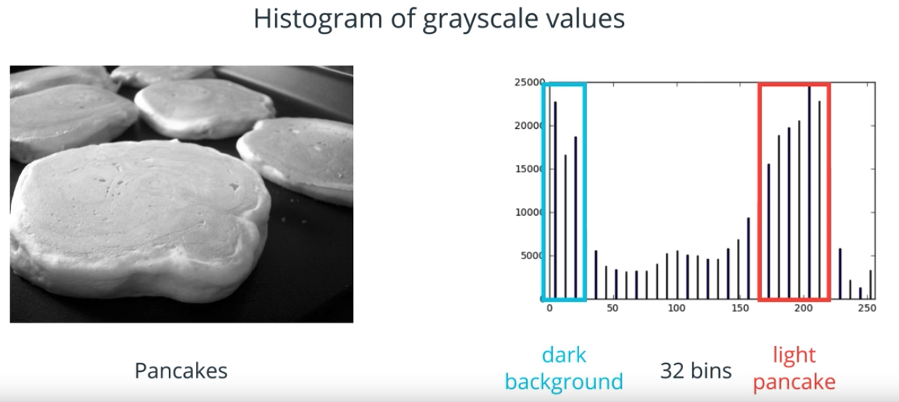
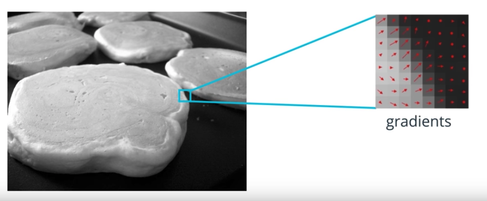
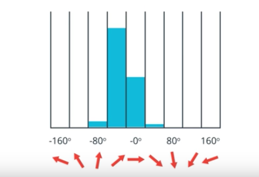

# Features and Object Recognition

Features are distinct and measurable pieces of information in an image and they're the basis of many machine learning and pattern recognition techniques.

Good features should be 
 
* **similarly identifiable**. They're easily tracked and compared.

* **consistent** across different scales, lighting conditions, and viewing angles.

* **visible** in noisy images and in images where only part of an object is visible.

* **repeatable**, such that the feature can be detected in two or more different images of the same object or scene.
   * This is probably the most important quality a good feature should have because it affects the generalization capability of the final trained model
   
Feature extraction is used to reduce the dimensionality of image data.

Feature extraction can transform complex and large image data into smaller sets of features by isolating specific color or spatial information.

## Types of Features

Most features fall into one of three categories: edges, corners, and blobs.

* `Edges` are areas in an image where the intensity abruptly changes. Also known as areas that have a high intensity gradient.

* `Corners` are at the intersection of two edges and form what looks like a corner or a sharp point.

* `Blobs` are region-based features that may include areas of extreme highs or lows in intensity or areas of a unique texture.

> We will be most interested in detecting corners because they're the most repeatable feature which means that they're easy to recognize given two or more images of the same scene.

## Feature Vectors

## Histogram of Oriented Gradients (HOG)

In computer vision there are many algorithms that are designed to extract spatial features and identify objects using information about image gradients. One illustrative technique is called HOG or **Histogram of Oriented Gradients**.

A **histogram** is a graphical representation of the distribution of data. It looks a bit like a bar graph with bars of different heights. Each bar represents a group of data that falls in a certain range of values, also called **bins**, and taller bars indicate that more data falls into a certain bin.

**Histogram of grayscale values**

Let us take a grayscale pancakes as an example and we want to display a histogram of intensity data. We know that all these pixel values range from 0 to 255 and we can create bins to partition these values into ranges.

1. We create 32 bins each holding a range of 8 pixel values: 0 to 7, 8 to 15, and so on up to 248 to 255.
2. To create a histogram we look at every pixel value in this image and put each one in its correct bin.

**Oriented gradients**

Oriented gradients means the direction or orientation of an image gradient.

**Histogram of oriented gradients**

HOG should produce a histogram of gradient direction in an image.

1. Calculates the magnitude and direction of the gradient at each pixel
2. Group these pixels into squre cells
	* In this particular example, we use cell with 8 by 8 grid. Each cell would have 64 gradient values.

3. For each of these cells, counts how many gradients in each cell fall in a certain range of orientations and sums the magnitude of these gradients so that the strength of the gradients are accounted for.
4. HOG places all that directional data of **each cell** into a histogram.

This histogram of oriented gradients is actually a feature vector. The next step will be to actually use these HOG features to train a classifer.

> The idea is that among images of the same object at different scales and orientions, the same pattern of HOG features can be used to detect object wherever and however it appears.

**Histograms in OpenCV**

Histograms are used in a variety of image analysis techniques and in creating feature vectors. Learn more about how to use histograms in OpenCV, [here](http://opencv-python-tutroals.readthedocs.io/en/latest/py_tutorials/py_imgproc/py_histograms/py_table_of_contents_histograms/py_table_of_contents_histograms.html).

**QUIZ QUESTION**

Histograms are often used in forming useful features because of how they divide data into ranges using bins. Why are bins so useful in creating good features? Select all answers that apply.

- [x] Bins reduce the dimensionality of data; they represent image data in a more compact way.
- [ ] Bins are the only way to group data
- [ ] Histograms help you visualize the most important values in an image
- [x] Grouping data into ranges allows for more flexibility in identifying similar objects based on their feature vectors.

