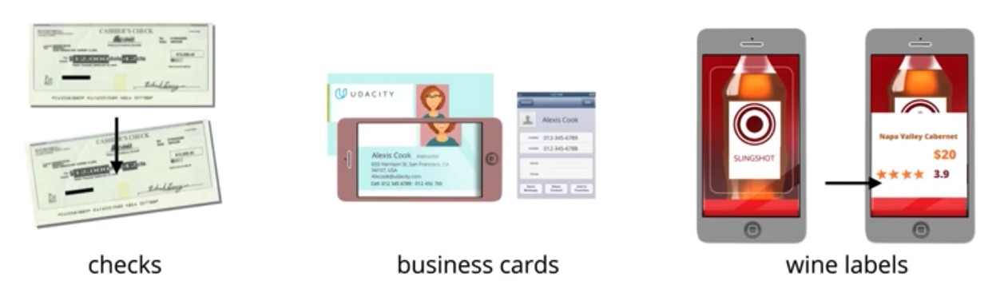

# Image Representation and Analysis

## Outline

* Preprocessing
* When color is important
* Image formation
* Image as Functions
* Color spaces and Transforms
* Geometric Transforms
* Frequency in images
* High-pass Filters
* How filters work
* Sobel Filters
* Low-pass Filters
* Gaussian Blur
* Canny Edge Detector

## Pre-processing

* Pre-processing is about making an image or sets of images easier to analyze and process computationally.
* Pre-processing an image has two main purposes.
	1. **Correct** images and eliminate unwanted traits. For example, correcting for uneven lighting conditions or sharpening a blurry image.
	2. **Enhance** the most important parts of an image and help extract the most important details.

* Really common pre-processing steps include,
	* changing color schemes like choosing to use grayscale images over color images,
	* changing how an image looks spatially by using geometric transforms which can scale an image, rotate it or even change how far away an object appears, and 	
	* changing how blurry or sharp an image appears by using filters to intensify or lessen the amount of contrast in an image.

These techniques are all used in different ways to push this computer vision pipeline towards its end goal - **capturing important patterns in image data and interpreting them**.

One of the most common pre-processing steps is changing an image from color to grayscale. This is because for many objects though not all, color is not needed to recognize and interpret an image.

**Grayscale is generally more useful for recognizing objects**. Color images contain more information than black and white images, they can add unnecessary complexity and take up more space and memory.

> It is more important to look at the intensity of an image which is a measure of lightness and darkness, and this is what grayscale images display. The patterns in lightness and darkness in an image often define the shape and distinguishing characteristics of different objects,

Therefore, the intensity alone can provide enough information to identify objects and interpret an image correctly.

(**Intensity**: A measure of lightness and darkness in an image)

**QUIZ QUESTION**

For each application, check the box if the image data should be converted to grayscale. Leave the box un-checked if color images would likely improve the accuracy of the application.

- [x] Identifying all chairs in images of an office
- [ ] Using computer aided diagnostics to identify red skin rashes in medical images
- [x] Programming a self-driving car to recognize all pedestrians in an image frame
- [x] Scanning a document and recognizing text

## When color is important

Now you've seen that for many simple image classification problems, grayscale images provide enough information about the shape and patterns of intensity in an image, to correctly classify the objects in them.

However, there are still a number of applications for which color is very important.

* For example, what if you were given an image of a road in grayscale, and I asked you to distinguish between the yellow and white lane line.
* This is an important difference because drivers have to treat yellow and white lane lines differently. You might see a slight difference in the grayscale intensity of the lane lines, but that difference is so small and it varies under different lighting conditions. So this grayscale image does not provide enough information to distinguish between the yellow and white lane lines.
* Ensuring that this road image is a color image becomes very important for this application.

> In general, if objects or traits are easier to identify in color for us humans, it is better to provide color images to algorithms.

A common example in which color can be very important is in computer-aided diagnostic tools.

* When human doctors look at your skin or something like an image of an organ or a tumor, **color can be a good indicator of health, illness, infection or a variety of other conditions**. So color images provide very helpful information in many medical applications.
* So as you think about image data and processing images, be careful about processing images in color or grayscale.

## Image formation

How does a computer actually see image data?

> Images are just 2D representations of 3D world scenes.

For example, if you take a picture of an apple which we know is a 3-D object, you'll get a 2D image that represents that apple.

The image contains detail about the 

* Color  
* Shape 
* Shading based on lighting conditions,
* Size based on distance

## Image as Functions

Let's take this image of a cat and look at how a computer understands it.

We'll be working with a grayscale image like this first, because as we know, color adds another layer of complexity. But the same general principles will apply as we'll see soon.

So when I show you an image of cat, you say, "Oh, it's a picture of a cat." It is also a function of two variables x and y which define a two dimensional area.

> All digital images are all made of a grid of pixels which are very small units of a single color or intensity.

Each pixel color has a corresponding numerical value. For grayscale images, 

* the value of each pixel ranges from 0 to 255. 
* 0 is black, 255 is white, and gray is in between. 
* So a value of around 200 is a very light gray, close to white, and a value around 20 will be a very dark gray, close to black.

And each pixel in addition to having a color value also has a location x, y in this image grid. These axes are a lot like axes for a graph, only for digital images, **the top left coordinate is at the origin, or the point x equals zero and y equals zero**.

As an example, this image of a cat is 700 pixels wide by 800 pixels tall. Since we start counting pixels from zero rather than one,this means that the coordinates for 800 pixels range from 0 to 799.

* The single pixel near the top right corner of the image is at the location x equals 600 and y equals 100.

* The pixel at the cat's tail is at about x equals 120 and y equals 400. This tail pixel is a very, very dark gray, close to black with a grayscale value of nine.

We can express this as a function of x and y by saying **F(120,400) = 9**, where F is just our image. I'm using F because it stands for function.

We can even visualize this grayscale image in 3D space, where x and y are still the width and height of an image, and the value of each pixel is shown by some corresponding height in a third dimension. image on the right in following Figure is rotated a bit more. 255, which is white has the greatest height, and zero has no height. So dark areas like the cat's tail and stripes should correspond to valleys in this third dimension, and peaks occur at the brightest spots.

Now that we know that we can treat images as functions of space, we can also think about operating on these functions mathematically, and changing or extracting information from these images. 

> Treating images as functions is the basis for many image processing techniques.

> In fact, we've already seen some applications of image processing such as geometrically warping the size and apparent shape of an image, or changing its appearance from color to grayscale. And each of these processing steps is actually just mathematically operating on and transforming an image, pixel by pixel.

**QUIZ QUESTION**

Most image processing techniques are just ways to mathematically operate on an image pixel-by-pixel. You can think of processing, as taking in an image, F(x, y), and outputting a transformed image G(x, y) which may have pixels of a different color or in a different location as the original image. With this in mind, take a look at the following quiz.

Given a grayscale image, F(x, y), match each of the following transformations with their application.

## Color spaces and Transforms

We have seen how to detect a blue screen background. But this detection assumed that the scene was very well lit and that the screen was a very consistent blue.

What would happen if the lighting changed and part of the wall was in shadow or washed out and bright? The simple blue color threshold wouldn't work very well in this scenario.

* How can we consistently detect objects under varying light conditions?

There are many other ways to represent the colors in an image besides just composed of red, green, and blue values. These different color representations are often called **color spaces**.

* RGB is red, green, blue color space. You can think of this as a 3D space where any color can be represented by a 3D coordinate of R, G, and B values. 
	* For example, white is on the corner here with a value of 255 255 255 for red green and blue values.

* HSV color space is for hue, saturation, and value.

* HLS color space if for hue, lightness, and saturation.

These are some of the most commonly used color spaces in image processing.

**HSV color space can detect colored objects more reliably than in RGB color space**

> HSV isolates the value or V component of each pixel in an image and this is the component that varies the most under different lighting conditions.

> The H channel stays fairly consistent under shadow or excessive brightness. If we rely mainly on this channel and discard the information in the V channel, we should be able to detect colored objects more reliably than in RGB color space.

## Geometric Transforms

Geometric transformations essentially move pixels around in an image based on a mathematical formula.

These types of transforms are useful for changing an image to a desired perspective like taking an angled image of some text and transforming it so that it appears as if you are looking at it straight on.

* How can we implement a geometric transformation and change the **apparent perspective** of an image?

> Mathematically we can characterize perspective by saying that in real world coordinates X, Y, and Z, the greater the magnitude of an object Z coordinate, or distance from the camera the smaller it will appear in a 2D image.

> A geometric transform uses this information to transform an image. It essentially transforms the apparent Z coordinate of the object points which in turn changes that objects 2D image representation.

> A geometric transform warps the image and effectively drags points towards or pushes them away from the camera to change the apparent perspective.

It can also transform the X and Y image pixels so that the entire image is rotated or moved slightly from the original perspective.

By transforming the perspective of an image you can more reliably measure or recognize certain image traits.

For example, you can measure the curvature of a road lane from a bird's eye view of a road and you can more easily read important text that's written at an angle.

Similarly, a common use for a geometric transform is in scanning and aligning text in a document. This transform is used in many applications like at banks that scan and read checks or in apps that scan and read everything from information on someone's business card to reading text on a wine label.

### Transforming Text

One common use for a computer vision is in scanning and aligning documents for better readability.

> Computer vision is used to align document scans and improve readability

As an example, we'll be working with a photo of a business card taken at an angle. A business card should show your name, job title and contact info. In the picture below, that text is a little hard to read.

We'll use a geometric transform to straighten it out.

You could imagine this being part of a larger application that lets you.

1. take a picture of someone's business card,
2. straightens out the image 
3. uses text recognition to read in the data on the card, and create a new contact for you.

But let's just focus on these first couple of steps: **taking in an image of a business card and straightening it**.

To create a geometric transform, we'll first select four points that define a rectangle on a plane in this original image. Four points are enough to define a linear transformation from one perspective to another.

* In this case, We are selecting points that define a plane on the surface of the business card.
* We will also select where we want those same four points to appear in our transformed (often called a warped) image.
* Then we can use open CV functions to calculate the transform that maps the points in the original image to the warped image with a different perspective.

## Frequency in images

We have an intuition of what frequency means when it comes to sound. High-frequency is a high pitched noise, like a bird chirp or violin. And low frequency sounds are low pitch, like a deep voice or a bass drum. For sound, frequency actually refers to how fast a sound wave is moving to make a certain pitch. Faster sound waves, make higher pitches and are called high-frequency waves.

### High and low frequency
Similarly, frequency in images is a rate of change. But, what does it means for an image to change? 

* Images change in space, 
* A **high frequency** image is one where the intensity changes a lot. The level of brightness changes quickly from one pixel to the next. 
* A **low frequency** image may be one that is relatively uniform in brightness or changes very slowly. 

This is easiest to see in an example.

Most images have both high-frequency and low-frequency components. In the image above, on the scarf and striped shirt, we have a high-frequency image pattern; this part changes very rapidly from one brightness to another. Higher up in this same image, we see parts of the sky and background that change very gradually, which is considered a smooth, low-frequency pattern.

## High-pass Filters

In image processing, filters are used to 

* filter out unwanted or irrelevant information in an image 
* amplify features like object boundaries or other distinguishing traits.

High-pass filters are used to
 
 * make an image appear sharper and 
 * enhance high-frequency parts of an image, which are areas where the levels of intensity in neighboring pixels rapidly change like from very dark to very light pixels.

Since we're looking at patterns of intensity, the filters we will be working with will be operating on grayscale images that represent this information and display patterns of lightness and darkness in a simple format.

Let's take a closer look at this panda image as an example. What do you think will happen if we apply a high-pass filter?

> Where there is no change or a little change in intensity in the original picture, such as in these large areas of dark and light, a high-pass filter will black these areas out and turn the pixels black,

> In areas where a pixel is way brighter than its immediate neighbors, the high-pass filter will enhance that change and create a line. You can see that this has the effect of emphasizing edges.

**Edges** are areas in an image where the intensity changes very quickly. They occur when an image changes from a very dark to light area. These edges often defines object boundaries which help us to distinguish and eventually identify those objects

Edge detection filters are also knows as high-pass filters. They detect big changes in intensity or color in an image and produce an output that shows these edges.

## How filters work

The filters in the form of matrices are often called **convolution kernels**, which are just grids of numbers that modify an image.

Here's an example of a high-pass filter that does edge detection.

This edge detection filter is a three by three kernel whose elements all sum to zero.

> It's important that for edge detection all of the elements sum to zero, because this filter is computing the difference or change between neighboring pixels.

> Differences are calculated by subtracting pixel values from one another.

> In this case, subtracting the value of the pixels that surround a center pixel, and if these kernel values did not add up to zero, that would mean that this calculated difference will be either positively or negatively weighted, which will have the effect of brightening or darkening the entire filtered image respectively.

To apply this filter, an input image F(xy) is convolved with this kernel, which I will call K. This is called 

* **Kernel convolution**. 
* Convolution is represented by an asterisk, not to be mistaken for a multiplication.

Mathematically, <b>K * F(x,y) = output image</b>

* Kernel convolution is an important operation in computer vision applications and it is the basis for convolutional neural networks. 

* It involves taking a kernel K, which is small grid of numbers, and passing it over an image pixel by pixel transforming it based on what these numbers are. 

* By changing these numbers, we can create many different effects from edge detection to blurring an image.

I will omit the details of how to compute the convolution here. You can find tons of articles or papers expaining the details.

Check the `create_edge_detection_filter.ipynb` to get hands-on experiences of how filters work.

**QUIZ QUESTION**

Of the four kernels pictured above, which would be best for finding and enhancing horizontal edges and lines in an image? ANS: d

## Sobel Filters

### Gradients

Gradients are a measure of intensity change in an image, and they generally mark object boundaries and changing area of light and dark. If we think back to treating images as functions, F(x, y), we can think of the gradient as a derivative operation F ’ (x, y). Where the derivative is a measurement of intensity change.

### Sobel filters

The Sobel filter is very commonly used in edge detection and in finding patterns in intensity in an image. Applying a Sobel filter to an image is a way of **taking (an approximation) of the derivative of the image** in the x or y direction. The operators for Sobel_x and Sobel_y, respectively, look like this:

Next, let's see an example of these two filters applied to an image of the brain.

**x vx. y**

In the above images, you can see that the gradients taken in both the x and the y directions detect the edges of the brain and pick up other edges. Taking the gradient in the x direction emphasizes edges closer to vertical. Alternatively, taking the gradient in the y direction emphasizes edges closer to horizontal.

**Magnitude**

Sobel filter also detects which edges are strongest. This is encapsulated by the magnitude of the gradient; the greater the magnitude, the stronger the edge is. The magnitude, or absolute value, of the gradient is just the square root of the squares of the individual x and y gradients. For a gradient in both the x and y directions, the magnitude is the square root of the sum of the squares.

**Direction**

In many cases, it will be useful to look for edges in a particular orientation. For example, we may want to find lines that only angle upwards or point left. By calculating the direction of the image gradient in the x and y directions separately, we can determine the direction of that gradient

The direction of the gradient is simply the inverse tangent (arctangent) of the y gradient divided by the x gradient:

## Low-pass Filters

Earlier you saw an example of noise in an image of San Francisco City Hall. 

* This noise is generally seen as speckles or discoloration in an image and it doesn't contain any useful information.
* It might mess with processing steps such as an edge detection when high pass filters can amplify noise if it's not removed first. 

The most common way to remove noise is by using a **low-pass filter**.

* Block certain high frequency parts of an image
* Effectively blur/smooth the appearance of an image

### Averaging Filters

We can reduce this noise by taking a kind of average between neighboring pixels so that there are not such big jumps in intensity especially in small areas.

This averaging of pixels in space is equivalent to implementing a low pass filter that blocks high frequency noise.

The first and simplest is the **Averaging Filter**. 

* It is a three by three kernel 
* It weights the center pixel and its surrounding pixels all the same.

Low pass filters typically take an average and not a difference as high pass filters do. So their components should all add up to one. This will preserve the image brightness and make sure that it does not get brighter or darker overall.

But we can see that the components of this kernel add up to nine. So we need to normalize by dividing the total value of the kernel by nine. Then our total sum becomes one.

### Convolution with Averaging Filter

> If we convolve this averaging filter with all pixels in this image, we will get an average to smoothed out image with fewer abrupt changes in intensity.

> This can be useful for blowing out noise or making a background area within a certain intensity range look more uniform.

> In fact, this sort of filter is even used in Photoshop to soften and blur parts of an image.

## Gaussian Blur

Instead of using an all around averaging filter, we may want to filter out blurs in image and better preserves the edges in it. For that, we use ganssian blur. This is perhaps the most frequently used low-pass filter in computer vision applications.

It is essentially a weighted average that gives the most weight to the center pixel but also takes into account the surrounding pixels, more so depending on how close they are to the center. 

## Canny Edge Detector

We have seen the importance of using both low-pass and high-pass filters for accurate edge detection. But even with these used together, edge detection is still a very complex problem.

We have to think about 

* What level of intensity change constitutes an edge,
* How we can consistently detect and represent both thin and thick edges.

One of the best and most frequently used edge detectors that takes all of these questions into account is the **Canny Edge Detector**. Canny edge detection is used very widely in computer vision applications because it goes through a series of steps that consistently produce accurately detected edges.

1. It filters out noise using a Gaussian blur.
2. It finds the strength and direction of edges in an image using Sobel filters,
3. Using the output of the Sobel filters, Canny then applies non-maximum suppression 
	* non-maximum suppression looks at the strength and direction of each detected edge and selects the local maximum pixel to create consistent one pixel wide thin lines that align with the strongest edges.
4. It uses a process called **hysteresis thresholding** to isolate the best edges.

### Hysteresis Thresholding

Hysteresis is a double thresholding process.

Let's see an example taking a one pixel wide cross-section of an image. The curve represents the level of intensity in edges where the peaks are very strong edges.

To perform hysteresis:

* We define a high threshold that allows these strong edges to pass through. 
* We also use a second low threshold. Any edge below this low threshold is considered weak and discarded.

* An edge whose strength falls in between this low threshold and the high threshold will be kept only when it is connected to another strong edge.

This way Canny 

* Eliminates weak edges and noise, 
* Isolates the edges that are the most connected and therefore are most likely to be part of an object boundary.

Because Canny emphasizes important edges, we'll see that it's very useful in boundary and shape detection.

## Summary

We learned about treating images as functions so that we could perform operations on pixel values and locations to transform the image! We used that knowledge to transform the color and geometry of images and to filter our images to enhance the most important information. We focused on learning how to implement one BIG step of the computer vision pipeline: Pre-processing!

Next, we'll see how this all fits together with the rest of the pipeline and move on to learning about and Selecting Areas of Interest using image segmentation techniques. Then we'll move on to more complex computer vision topics and object recognition!

