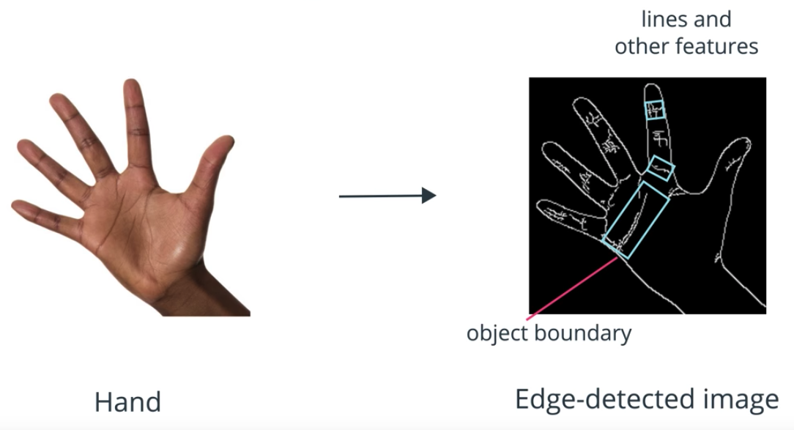
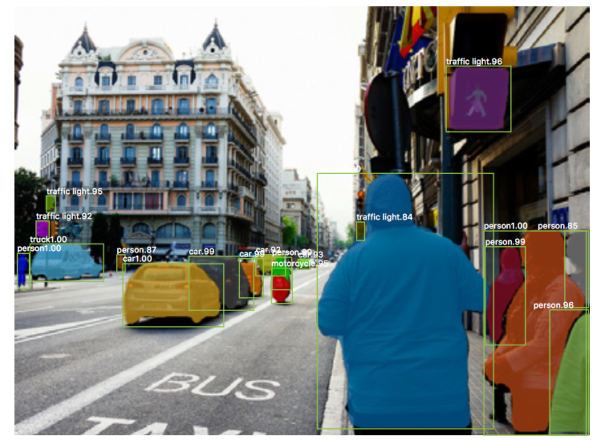

# Image Segmentation

Image segmentation is the process of dividing an image into segments or unique areas of interest.

Image segmentation is done in two main ways.

1. by connecting a series of detected edges 
2. by grouping an image into separate regions by area or distinct traits.

## Image Contours

Edge detection algorithms are often used to detect the boundaries of objects.

But, after performing edge detection you'll often be left with sets of edges that highlight not only object boundaries but also interesting features and lines.

To do image segmentation, we want only complete closed boundaries that marked distinct areas and objects in an image. One technique that's useful for this is called, **Image Contouring**.

* Image contours are **continuous curves** that follow the edges along a perceived boundary.

* Contours can be used for image segmentation and they can also provide a lot of information about the shape of an object boundary.

* In OpenCV contours are best detected when there's a white object against a black background.

So before we can identify contours in an image, we will first need to create a binary threshold of image
that has black and white pixels that distinguish different objects in an image. We will then use the edges of these objects to form contours.

This binary image is often produced by a simple threshold as shown here, or by a Canny edge detector.

## K-means Clustering

K-means clustering is a machine learning technique that separates an image into segments by clustering or grouping together data points that have similar traits. 

### K-means clustering on image data

Each pixel in an image has an associated RGB value. In fact, we can plot the value of each pixel as a data point in RGB color space. We can see that the points fall into natural color clusters.

### K-means clustering algorithm

1. Choose K random center points
2. Assign every data point to a cluster, based on it nearest center point
3. Calculate the mean of all values in each cluster
	* These mean values become the new center points of clusters
4. Repeat steps 2 and 3 until convergence is reached
	* The convergence is defined by us. Usually, it is after a number of iterations or based on how much the center points move after each iteration. 

## CNN's in Image Segmentation

Convolutional neural networks are generally associated with image classification tasks where these networks learn to recognize objects given lots of labeled data. 

Given many images of dogs, CNN's can be used to accurately identify many different breeds and sizes of dogs better than many humans. However, humans often don't just look for one object at a time to recognize and identify; they often look at the many pieces and objects that make up a scene -- background, foreground, perceived movement, and arrangement of objects -- and we form a larger understanding of what is actually happening in an image. This is much more than classification; it's interpretation and breaking an image into many important pieces.

The first step in this is accurate segmentation, and many CNN architectures have been developed to help with this task.

### From classification to segmentation

One of the most basic use of CNN's in image segmentation is actually an extended classification algorithm. Instead of recognizing single objects; CNN's can be trained to classify every pixel in an image so that the image is broken up into these different segments. This can be a very slow learning process, so other, faster algorithms are still being researched and developed. Some networks learn from smaller maps of image features. You are encouraged to read about the latest CNN segmentation techniques, [here](https://blog.athelas.com/a-brief-history-of-cnns-in-image-segmentation-from-r-cnn-to-mask-r-cnn-34ea83205de4).

## Summary

We have talked about Pre-processing, which was all about correcting and enhancing our original images through things like geometric or color transformations.

Then, we looked at Selecting Areas of Interest by using information about color, geometry, and patterns of intensity in images; going through many image segmentation techniques that move us close to the end of the pipeline: object recognition, and scene understanding.

The next step in our computer vision pipeline is to detect and extract important features, so that we can recognize objects and predict behaviors in an image.

